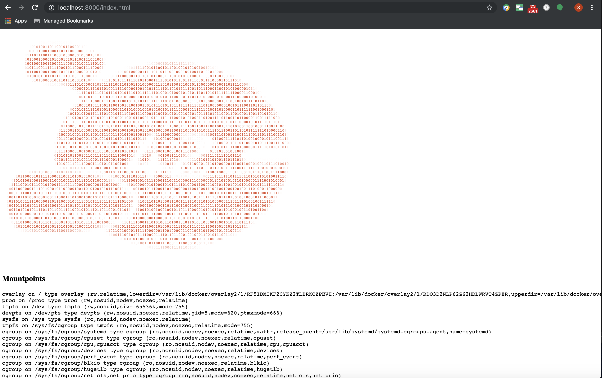

# dazmodel_platform
Sergii Sinienok - Platform repository

# TOC
1. [Домашнее задание №1](#Домашнее-задание-№1)

## Домашнее задание №1

### Выполнено ДЗ №1

 - [X] Основное ДЗ

### В процессе сделано:
 - Установлен *kubectl* при помощи Homebrew - `brew install kubernetes-cli`.
    ```shell
    kubectl version                                                       (:|✔)
    Client Version: version.Info{Major:"1", Minor:"12+", GitVersion:"v1.12.8-dispatcher", GitCommit:"1215389331387f57594b42c5dd024a2fe27334f8", GitTreeState:"clean", BuildDate:"2019-05-13T18:18:50Z", GoVersion:"go1.10.8", Compiler:"gc", Platform:"darwin/amd64"}
    Unable to connect to the server: dial tcp 192.168.99.100:8443: i/o timeout
    ```
 - Настроен Kubectl Autocomplete для ZSH:
    ```shell
    source <(kubectl completion zsh)  # setup autocomplete in zsh into the current shell
    echo "if [ $commands[kubectl] ]; then source <(kubectl completion zsh); fi" >> ~/.zshrc # add autocomplete permanently to your zsh shell
    ```
 - Установлен *VirtualBox* через Homebrew - `brew cask install virtualbox`
 - Установлен *minicube* через Homebrew - `brew cask install minikube`
    ```shell
    minikube start                                                                    (:|✔)
    😄  minikube v1.2.0 on darwin (amd64)
    💡  Tip: Use 'minikube start -p <name>' to create a new cluster, or 'minikube delete' to delete this one.
    🔄  Restarting existing virtualbox VM for "minikube" ...
    ⌛  Waiting for SSH access ...
    🐳  Configuring environment for Kubernetes v1.15.0 on Docker 18.09.6
    🔄  Relaunching Kubernetes v1.15.0 using kubeadm ...
    ⌛  Verifying: apiserver proxy etcd scheduler controller dns
    🏄  Done! kubectl is now configured to use "minikube"
    ```
 - Посмотрел информацию по поднятому k8s кластеру
    ```shell
    kubectl cluster-info                                                                                                                                                                                                                (:|✔)
    Kubernetes master is running at https://192.168.99.100:8443
    KubeDNS is running at https://192.168.99.100:8443/api/v1/namespaces/kube-system/services/kube-dns:dns/proxy

    To further debug and diagnose cluster problems, use 'kubectl cluster-info dump'.
    ```
 - Установлен *Dashboard*. Гайд по генерации JWT для логина: https://github.com/kubernetes/dashboard/wiki/Creating-sample-user
    <br/>
    <details>
    <summary>Результат</summary>

    ```shell
    kubectl apply -f https://raw.githubusercontent.com/kubernetes/dashboard/v2.0.0-beta1/aio/deploy/recommended.yaml                                                                                                                    (:|✔)
    namespace/kubernetes-dashboard created
    serviceaccount/kubernetes-dashboard created
    service/kubernetes-dashboard created
    secret/kubernetes-dashboard-certs created
    secret/kubernetes-dashboard-csrf created
    secret/kubernetes-dashboard-key-holder created
    configmap/kubernetes-dashboard-settings created
    role.rbac.authorization.k8s.io/kubernetes-dashboard created
    clusterrole.rbac.authorization.k8s.io/kubernetes-dashboard created
    rolebinding.rbac.authorization.k8s.io/kubernetes-dashboard created
    clusterrolebinding.rbac.authorization.k8s.io/kubernetes-dashboard created
    deployment.apps/kubernetes-dashboard created
    service/dashboard-metrics-scraper created
    deployment.apps/kubernetes-metrics-scraper created
    ```
    </details>

 - Установлен k9s - `brew install derailed/k9s/k9s`
 - Успешно приконнектился по SSH к виртуальной машине minikube:
    <br/>
    <details>
    <summary>Результат</summary>

    ```shell
    minikube ssh                                                                                                                                                                                                                        (:|✔)
                            _             _            
                _         _ ( )           ( )           
    ___ ___  (_)  ___  (_)| |/')  _   _ | |_      __  
    /' _ ` _ `\| |/' _ `\| || , <  ( ) ( )| '_`\  /'__`\
    | ( ) ( ) || || ( ) || || |\`\ | (_) || |_) )(  ___/
    (_) (_) (_)(_)(_) (_)(_)(_) (_)`\___/'(_,__/'`\____)

    $ docker ps
    CONTAINER ID        IMAGE                          COMMAND                  CREATED             STATUS              PORTS               NAMES
    024dc749f4cc        kubernetesui/metrics-scraper   "/metrics-sidecar"       About an hour ago   Up About an hour                        k8s_kubernetes-metrics-scraper_kubernetes-metrics-scraper-86456cdd8f-9bxm4_kubernetes-dashboard_8c3fe82c-c9a5-41ba-ab07-a4a9f2904e17_0
    7ced44e4bd96        kubernetesui/dashboard         "/dashboard --insecu…"   About an hour ago   Up About an hour                        k8s_kubernetes-dashboard_kubernetes-dashboard-5c8f9556c4-z98ll_kubernetes-dashboard_ea51f79b-96cf-45d5-b107-047c3ee3db54_0
    2def2f541249        k8s.gcr.io/pause:3.1           "/pause"                 About an hour ago   Up About an hour                        k8s_POD_kubernetes-metrics-scraper-86456cdd8f-9bxm4_kubernetes-dashboard_8c3fe82c-c9a5-41ba-ab07-a4a9f2904e17_0
    e93bf4ff220b        k8s.gcr.io/pause:3.1           "/pause"                 About an hour ago   Up About an hour                        k8s_POD_kubernetes-dashboard-5c8f9556c4-z98ll_kubernetes-dashboard_ea51f79b-96cf-45d5-b107-047c3ee3db54_0
    4dccba57af0e        4689081edb10                   "/storage-provisioner"   About an hour ago   Up About an hour                        k8s_storage-provisioner_storage-provisioner_kube-system_f654d832-ab0f-4f78-8d11-e52c9eb720d5_1
    d820541549ed        eb516548c180                   "/coredns -conf /etc…"   About an hour ago   Up About an hour                        k8s_coredns_coredns-5c98db65d4-9f2sd_kube-system_dd81902d-511d-4478-b503-30bc1eabaed1_1
    0d4833c3c08c        eb516548c180                   "/coredns -conf /etc…"   About an hour ago   Up About an hour                        k8s_coredns_coredns-5c98db65d4-8mp8f_kube-system_2d197c6d-6bdb-409c-ac88-0d1ccc21a4d5_1
    1fe9d36d6e21        k8s.gcr.io/pause:3.1           "/pause"                 About an hour ago   Up About an hour                        k8s_POD_storage-provisioner_kube-system_f654d832-ab0f-4f78-8d11-e52c9eb720d5_1
    15cd1d687a2c        k8s.gcr.io/pause:3.1           "/pause"                 About an hour ago   Up About an hour                        k8s_POD_coredns-5c98db65d4-9f2sd_kube-system_dd81902d-511d-4478-b503-30bc1eabaed1_1
    2785c8376330        k8s.gcr.io/pause:3.1           "/pause"                 About an hour ago   Up About an hour                        k8s_POD_coredns-5c98db65d4-8mp8f_kube-system_2d197c6d-6bdb-409c-ac88-0d1ccc21a4d5_1
    18100a3dcb66        d235b23c3570                   "/usr/local/bin/kube…"   About an hour ago   Up About an hour                        k8s_kube-proxy_kube-proxy-vsbjg_kube-system_a23eeedf-fc2b-4680-9514-1126fb96346f_1
    798e9906cbaf        k8s.gcr.io/pause:3.1           "/pause"                 About an hour ago   Up About an hour                        k8s_POD_kube-proxy-vsbjg_kube-system_a23eeedf-fc2b-4680-9514-1126fb96346f_1
    ef0bf9692484        2c4adeb21b4f                   "etcd --advertise-cl…"   About an hour ago   Up About an hour                        k8s_etcd_etcd-minikube_kube-system_89f36d1de777528a3e8b9a2534a41af4_1
    02d64c8d7ea3        2d3813851e87                   "kube-scheduler --bi…"   About an hour ago   Up About an hour                        k8s_kube-scheduler_kube-scheduler-minikube_kube-system_31d9ee8b7fb12e797dc981a8686f6b2b_3
    c2910113e4b8        8328bb49b652                   "kube-controller-man…"   About an hour ago   Up About an hour                        k8s_kube-controller-manager_kube-controller-manager-minikube_kube-system_676a8a1e3e146d0c0f7c4f6e1e96b578_2
    4e278a728c9f        119701e77cbc                   "/opt/kube-addons.sh"    About an hour ago   Up About an hour                        k8s_kube-addon-manager_kube-addon-manager-minikube_kube-system_65a31d2b812b11a2035f37c8a742e46f_1
    45aee4c9ad76        201c7a840312                   "kube-apiserver --ad…"   About an hour ago   Up About an hour                        k8s_kube-apiserver_kube-apiserver-minikube_kube-system_e0f883122ef4b18e9fbea5c005bca446_1
    634f1aecaff0        k8s.gcr.io/pause:3.1           "/pause"                 About an hour ago   Up About an hour                        k8s_POD_kube-scheduler-minikube_kube-system_31d9ee8b7fb12e797dc981a8686f6b2b_1
    585936e3057f        k8s.gcr.io/pause:3.1           "/pause"                 About an hour ago   Up About an hour                        k8s_POD_kube-controller-manager-minikube_kube-system_676a8a1e3e146d0c0f7c4f6e1e96b578_1
    fd59a861af68        k8s.gcr.io/pause:3.1           "/pause"                 About an hour ago   Up About an hour                        k8s_POD_kube-apiserver-minikube_kube-system_e0f883122ef4b18e9fbea5c005bca446_1
    c02a86777b61        k8s.gcr.io/pause:3.1           "/pause"                 About an hour ago   Up About an hour                        k8s_POD_etcd-minikube_kube-system_89f36d1de777528a3e8b9a2534a41af4_1
    478717856c4b        k8s.gcr.io/pause:3.1           "/pause"                 About an hour ago   Up About an hour                        k8s_POD_kube-addon-manager-minikube_kube-system_65a31d2b812b11a2035f37c8a742e46f_1
    $
    ```
    </details>
    <br/>
 - Проверки кластера Kubernetes на отказоустойчивость:
    <br/>
    <details>
    <summary>Результат</summary>

    ```shell
    docker rm -f $(docker ps -a -q)
    024dc749f4cc
     .....
    530f58cf8b7e

    kubectl get pods -n kube-system                                                                                                                                                                                                     (:|✔)
    NAME                               READY   STATUS    RESTARTS   AGE
    coredns-5c98db65d4-8mp8f           1/1     Running   0          2d
    coredns-5c98db65d4-9f2sd           1/1     Running   0          2d
    etcd-minikube                      1/1     Running   0          2d
    kube-addon-manager-minikube        1/1     Running   0          2d
    kube-apiserver-minikube            1/1     Running   0          2d
    kube-controller-manager-minikube   1/1     Running   0          2d
    kube-proxy-vsbjg                   1/1     Running   0          2d
    kube-scheduler-minikube            1/1     Running   0          2d
    storage-provisioner                1/1     Running   1          2d

    kubectl delete pod --all -n kube-system                                                                                                                                                                                             (:|✔)
    pod "coredns-5c98db65d4-8mp8f" deleted
    pod "coredns-5c98db65d4-9f2sd" deleted
    pod "etcd-minikube" deleted
    pod "kube-addon-manager-minikube" deleted
    pod "kube-apiserver-minikube" deleted
    pod "kube-controller-manager-minikube" deleted
    pod "kube-proxy-vsbjg" deleted
    pod "kube-scheduler-minikube" deleted
    pod "storage-provisioner" deleted

    kubectl get componentstatuses                                                                                                                                                                                                       (:|✔)
    NAME                 STATUS    MESSAGE             ERROR
    scheduler            Healthy   ok                  
    controller-manager   Healthy   ok                  
    etcd-0               Healthy   {"health":"true"}
    ```
    </details>
    <br/>
 - Причины восстановления pods в namespace kube-system:
    - kube-addon-manager, etcd-minikube, kube-apiserver-minikube, kube-controller-manager-minikube, kube-scheduler-minikube -  сконфигурированы как static pods, запускаются и рестартится через Systemd Service операционной системы:
    <br/>
    <details>
    <summary>Результат</summary>

    ```shell
    systemctl show kubelet | grep ExecStart
    ExecStart={ path=/usr/bin/kubelet ; argv[]=/usr/bin/kubelet --authorization-mode=Webhook --bootstrap-kubeconfig=/etc/kubernetes/bootstrap-kubelet.conf --cgroup-driver=cgroupfs --client-ca-file=/var/lib/minikube/certs/ca.crt --cluster-dns=10.96.0.10 --cluster-domain=cluster.local --container-runtime=docker --fail-swap-on=false --hostname-override=minikube --kubeconfig=/etc/kubernetes/kubelet.conf --pod-manifest-path=/etc/kubernetes/manifests ; ignore_errors=no ; start_time=[Wed 2019-07-10 18:13:34 UTC] ; stop_time=[n/a] ; pid=3043 ; code=(null) ; status=0/0 }

    $ cd /etc/kubernetes/manifests
    $ ls -la
    total 20
    drwxr-xr-x 2 root root    0 Jul 10 18:13 .
    drwxr-xr-x 4 root root    0 Jul 10 18:13 ..
    -rw-r----- 1 root root 1406 Jul 10 18:13 addon-manager.yaml.tmpl
    -rw------- 1 root root 1971 Jul 10 18:13 etcd.yaml
    -rw------- 1 root root 2895 Jul 10 18:13 kube-apiserver.yaml
    -rw------- 1 root root 2264 Jul 10 18:13 kube-controller-manager.yaml
    -rw------- 1 root root  990 Jul 10 18:13 kube-scheduler.yaml
    ```
    </details>
    <br/>
    - coredns - всегда восстанавливается в количестве 2х штук потому, что управляется через Deployment, который создает соответствующий ReplicaSet:
    <br/>
    <details>
    <summary>Результат</summary>

    ```shell
    kubectl get deployment  -n kube-system                                    (kubernetes-intro|✚1…)
    NAME      READY   UP-TO-DATE   AVAILABLE   AGE
    coredns   2/2     2            2           2d
    ```
    </details>
    <br/>
    - kube-proxy - всегда восстанавливается потому, что управляется DaemonSet controller:
    <br/>
    <details>
    <summary>Результат</summary>

    ```shell
    kubectl get ds -n kube-system                                             (kubernetes-intro|✚1…)
    NAME         DESIRED   CURRENT   READY   UP-TO-DATE   AVAILABLE   NODE SELECTOR                 AGE
    kube-proxy   1         1         1       1            1           beta.kubernetes.io/os=linux   2d
    ```
    </details>
    <br/>
    - storage-provisioner - addon, его yaml определение лежит в /etc/kubernetes/addons и восстанавливается оттуда
 - Сделан Dockerfile с Nginx внутри как веб-сервер. Была проблема с запуском nginx под нерутовым юзером, этот гайд помог решить http://pjdietz.com/2016/08/28/nginx-in-docker-without-root.html. Docker Image опубликован на DockerHub https://hub.docker.com/r/debugss/k8s-infrastructure-platform/tags
 - Написан манифест для web-pod.yaml с одним контейнерос с Docker Hub. Проведен траблшутинг запуска pod:
<br/>
<details>
    <summary>Результат</summary>

    ```shell
    kubectl describe pod web                                                        (kubernetes-intro|✚1…)
    Name:               web
    Namespace:          default
    Priority:           0
    PriorityClassName:  <none>
    Node:               minikube/10.0.2.15
    Start Time:         Thu, 11 Jul 2019 13:14:01 +0300
    Labels:             app=web
    Annotations:        kubectl.kubernetes.io/last-applied-configuration:
                        {"apiVersion":"v1","kind":"Pod","metadata":{"annotations":{},"labels":{"app":"web"},"name":"web","namespace":"default"},"spec":{"container...
    Status:             Running
    IP:                 172.17.0.3
    Containers:
    dazmodel-k8s-intro:
        Container ID:   docker://cea01b9d2570e5e2c6fa5b9019bbab55ff77a6705f52206fb6dc2e057dda8939
        Image:          debugss/k8s-infrastructure-platform:1.0
        Image ID:       docker-pullable://debugss/k8s-infrastructure-platform@sha256:38e26ed2e5b942190db20d1e241d1d822b402836739a6842c39afe4689677268
        Port:           <none>
        Host Port:      <none>
        State:          Running
        Started:      Thu, 11 Jul 2019 13:14:02 +0300
        Ready:          True
        Restart Count:  0
        Environment:    <none>
        Mounts:
        /var/run/secrets/kubernetes.io/serviceaccount from default-token-n5vhp (ro)
    Conditions:
    Type              Status
    Initialized       True 
    Ready             True 
    ContainersReady   True 
    PodScheduled      True 
    Volumes:
    default-token-n5vhp:
        Type:        Secret (a volume populated by a Secret)
        SecretName:  default-token-n5vhp
        Optional:    false
    QoS Class:       BestEffort
    Node-Selectors:  <none>
    Tolerations:     node.kubernetes.io/not-ready:NoExecute for 300s
                    node.kubernetes.io/unreachable:NoExecute for 300s
    Events:
    Type    Reason     Age   From               Message
    ----    ------     ----  ----               -------
    Normal  Scheduled  7m1s  default-scheduler  Successfully assigned default/web to minikube
    Normal  Pulled     7m    kubelet, minikube  Container image "debugss/k8s-infrastructure-platform:1.0" already present on machine
    Normal  Created    7m    kubelet, minikube  Created container dazmodel-k8s-intro
    Normal  Started    7m    kubelet, minikube  Started container dazmodel-k8s-intro
    ```
</details>
<br/>

 - В web pod добавлен volume. Этот же volume подключен к init-container и app container. Web pod удален и перезапущен:
<br/>
<details>
    <summary>Результат</summary>

    ```shell
    kubectl delete pod web                                                          (kubernetes-intro|✚1…)
        pod "web" deleted

    [~/Documents/SRC/dazmodel_platform/kubernetes-intro] kubectl apply -f web-pod.yaml && kubectl get pods -w                            (kubernetes-intro|✚1…)
    pod/web created
    NAME   READY   STATUS     RESTARTS   AGE
    web    0/1     Init:0/1   0          0s
    web   0/1   PodInitializing   0     2s
    web   1/1   Running   0     3s
    ```
</details>
<br/>

- Установлен Kube Forwarder. Настроен порт форвардинг для локальной разработки.

### Как запустить проект:
 - В корне проекта выполнить `kubectl apply -f kubernetes-intro/web-pod.yaml && kubectl get pods -w`
 - В новом окне терминала выполнить `port-forward pod/web 8000:8000`

### Как проверить работоспособность:
 - В окне браузера перейти по ссылке http://localhost:8000/index.html. Ожидаемый результат: 


### PR checklist:
 - [X] Выставлен label с номером домашнего задания
 - [X] Лектор добавлен в Assignees
 - [X] Добавлен файл `.github/PULL_REQUEST_TEMPLATE.md` с соответствующим контентом
 - [X] Добавлен файл `.travis.yaml` с соответствующим контентом